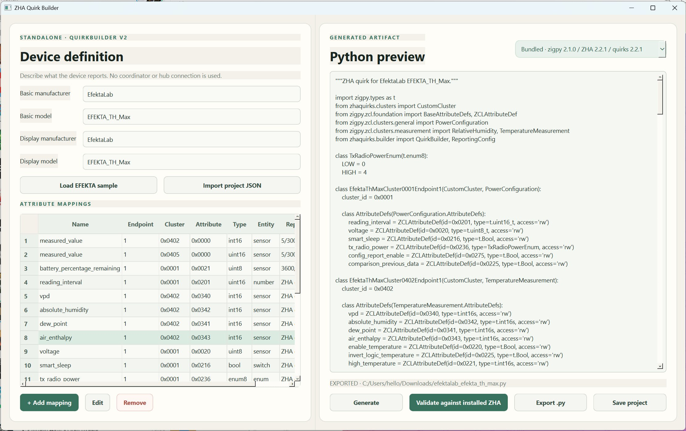
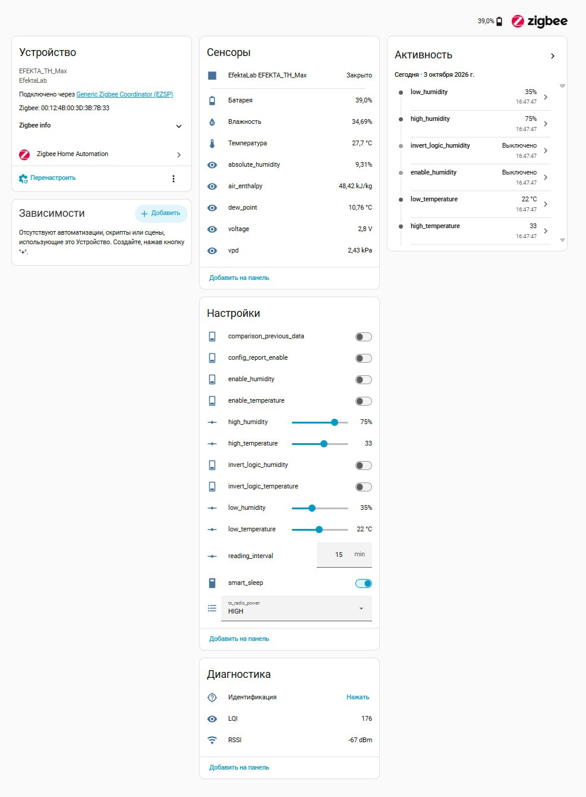
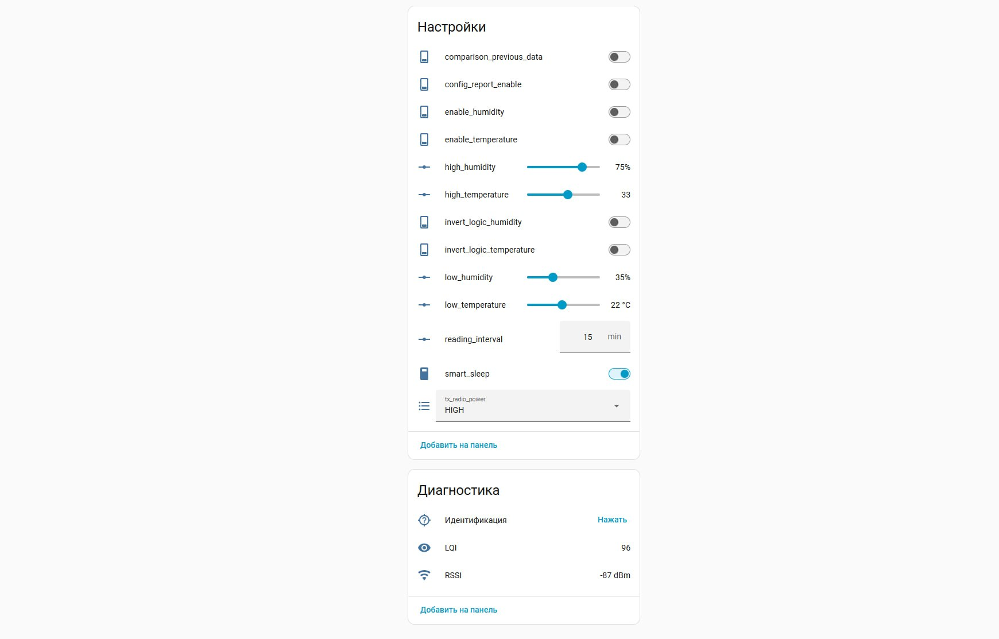

# ZHA Quirk Builder

Standalone desktop editor for generating and validating ZHA QuirkBuilder v2 files.
It does not depend on Zigbee Hub and does not connect to a coordinator.



## Features

- visual mapping of Zigbee attributes to ZHA sensors, numbers, switches, binary
  sensors, and enum selects;
- generation of custom clusters while preserving standard ZCL attributes;
- reporting configuration and replacement of default ZHA entities;
- validation against bundled, latest stable, or custom zigpy/ZHA/zha-quirks versions;
- project import/export and standalone desktop packages for Windows, macOS, and Linux.

## Home Assistant result

Generated quirks can expose standard measurements and manufacturer-specific
attributes as native ZHA entities.

| Sensors | Configuration entities |
| --- | --- |
|  |  |

## Download

Download the latest standalone package from
[GitHub Releases](https://github.com/faronov/zha-quirk-builder/releases/latest).
No separate Python installation is required.

## Development

Python 3.12 or newer is required because the current ZHA and zha-quirks releases
require Python 3.12.

```shell
python3.12 -m venv .venv
.venv/bin/pip install -e '.[dev]'
.venv/bin/zha-quirk-builder
```

On Windows, use `.venv\Scripts\pip` and `.venv\Scripts\zha-quirk-builder`.

The compatibility result always includes the exact installed Python, zigpy, ZHA,
and zha-quirks versions. Dependencies track the current compatible minor release
line and resolve to the newest version available from the configured package
index. A successful syntax check alone is not presented as upstream compatibility.

Use the profile selector above the generated Python preview to choose:

- **Bundled** for the versions shipped inside the application;
- **Latest stable** for the current stable zigpy/ZHA/zha-quirks combination;
- **Custom versions** to enter an exact three-version compatibility matrix.

Non-bundled profiles are installed into separate cached environments with `uv`.
Changing a profile never modifies the application environment. The first check
downloads the selected packages; subsequent checks reuse that profile cache.

## Desktop packages

GitHub Actions builds:

- Windows x64 and ARM64 ZIP archives containing a standalone `.exe`;
- macOS Intel x64 and Apple Silicon ARM64 ZIP archives containing a standalone `.app`;
- Linux x64 and ARM64 `.tar.gz` archives containing a standalone executable.

No separate Python installation is required for packaged applications. Push a
tag such as `v0.1.0` to create a GitHub release containing all platform archives.
